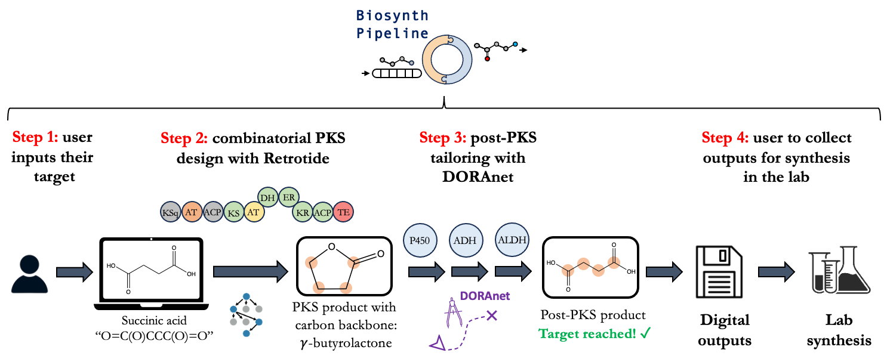

# Biosynth Pipeline

**Biosynth Pipeline** is a combined retrobiosynthesis pipeline intended to expand the design space of feasible
biosynthetic pathways between simple, inexpensively available precursors and high-value small molecules. 
Biosynth Pipeline has been developed by integrating two software packages: **Retrotide**, which specializes in modular
polyketide synthase (PKS) retrobiosynthesis, and **DORAnet**, tailored for singular enzymatic synthesis. 
With Biosynth Pipeline, users will first specify the target molecule for which they wish to discover biosynthetic pathways.
Subsequently, users will have the option of either performing PKS retrobiosynthesis first and then a DORAnet expansion or 
vice versa - though the former sequence is a more common occurrence in metabolic engineering given that there are only a 
couple of starter molecules that PKSs can accept (such as Malonyl-CoA). 

When a target molecule cannot be reached by Retrotide, i.e. by PKSs alone, DORAnet will accept the PKS product that is 
closest to the downstream target as an input and perform a network expansion to reach the target. This network expansion involves 
recursively applying either biological or chemical reaction rules for a predetermined number of steps.
If DORAnet fails to find pathways between the PKS product and the final product, users can move onto other PKS designs
instead, which may generate PKS products that DORAnet can indeed transform into the final product. If the other PKS designs
still fail to reach the final product, DORAnet will run a reverse expansion on the final target molecule to generate a list of upstream precursors. 
For each precursor in this list, Retrotide will be deployed to generate PKS designs to synthesize these precursors.

In order to ensure that this dynamic pathway discovery process is as seamless as possible, there are three modalities via which you can run Biosynth Pipeline:

(1) as a python script (```biosynth_pipeline/biosynth_pipeline.py```)

(2) as a Jupyter notebook (```notebooks/WorkingDemoBiosynthPipeline.ipynb```)

(3) or most simply, with our graphical user interface (GUI)

If you choose to use notebooks, we have provided a couple of tutorials under ```notebooks/tutorials/```, which may be useful
(but not critical!). If you prefer using the GUI, read onto the next section!



